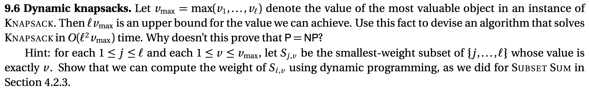
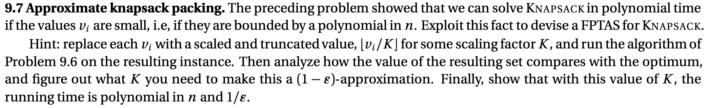
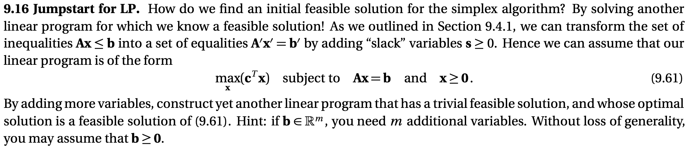

# HW1



The knapsack problem: 


A dp algorithm to solve the knapsack problem: define a function $A(U)$ as the minimum weight of the knapsack that has the value $U$, it follows that:
* $A(0) = 0$
* $A(l) = \max\{A(l - 1), \{w_j + A(l - v_j) \mid v_j \leq l \} \}$.

Then one can compute $A(\cdot)$ iteratively until $A(j) \geq W$ for the first time.
Since we know that $U \leq \ell v_{max}$, and in each step we need to compute $\ell$ times, the time complexity is $O(\ell^2 v_{max})$. However, $v_{max}$ can be exponential to $\ell$, so the time complexity can be exponential and the problem is still in NP.



With the method proposed in the question, the cost of the approximation algorithm is $O(\ell^2 \lfloor v_{max} / K \rfloor)$. In the worst case the error is $\ell v_{max} (1 - K^{-1})$, so that the approximation ratio is at most $\ell(1 - K^{-1})$. Then to reach a $1 - \epsilon$ approximation ratio, we need to have $\ell(1 - K^{-1}) \sim \epsilon$, clearly $K$ is polynomial in ${\epsilon}^{-1}$ and the algorithm is a FPTAS for the knapsack problem.




At the begining, just assume $x_1 = x_2 = ... = x_n = 0$, which is not a feasible solution. Then define a vector $s$ with length $m$ with $s_i = b_i$. Then $(x, s)$ is a feasible solution of the following constraint:
```math
  \left(\begin{matrix}
   A & 0\\
   0 & I
  \end{matrix}\right)
  \left(\begin{matrix}
   x\\
   s
  \end{matrix}\right) = b
```
Under this constraint, we minimize the target function $\sum_{i=1}^m s_i$ until it equals to $0$, which gives a feasible solution for the original problem.
